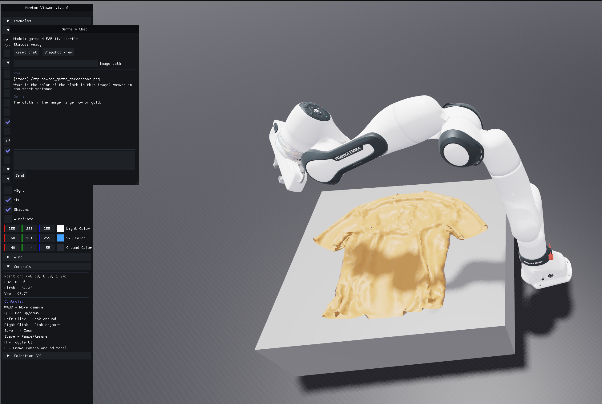

# newton-gemma

Gemma 4 multimodal chat embedded in [Newton](https://github.com/newton-physics/newton)'s
OpenGL viewer. The chat panel grabs a live screenshot of the simulation,
sends it to Gemma 4 (E2B, multimodal) via [LiteRT-LM](https://ai.google.dev/edge/litert-lm),
and streams the reply back into the viewer.

By default it auto-asks **"What is the color of the cloth in this image?"**
once Gemma is loaded and the cloth has settled, then keeps the chat open for
follow-ups.



## Repo layout

| File | Purpose |
| --- | --- |
| `example_robot_panda_hydro_gemma.py` | Entry point. Subclasses a Newton example (`cloth_franka` or `panda_hydro`) and registers an ImGui chat window. |
| `gemma_chat.py` | `GemmaChat` — wraps `litert_lm.Engine` + `Conversation` on a worker thread; streams chunks back via a queue. |
| `snapshot_camera.py` | Two snapshot paths: `screenshot_gl_viewer` (real `glReadPixels` of the viewer FBO) and `SnapshotCamera` (Warp-raytraced fallback via `newton.sensors.SensorTiledCamera`). |
| `newton_commands.txt` | Reference Newton example commands. |

## Requirements

- Python 3.12 (the included `myenv/` was built against it).
- Newton 1.1+ (`pip install newton`).
- LiteRT-LM Python (`pip install litert-lm`).
- imgui-bundle, Pillow, numpy, warp-lang.
- The Gemma 4 E2B `.litertlm` weights (~2.6 GB), downloaded into `models/`
  (see below).

CUDA is **optional**. The wrapper carries shims so the script runs on a
CPU-only host:
- Replaces `wp.empty(..., pinned=True)` with the non-pinned variant when no
  CUDA device is detected (Newton's GL viewer otherwise crashes inside
  `viewer_gl._build_packed_vbo_arrays`).
- Drops the unsupported `device=` kwarg from `wp.Mesh(...)` (Newton's
  raytrace `render_context.refit_bvh` still passes it on this Warp version).

## Setup

```bash
python3.12 -m venv myenv
source myenv/bin/activate
pip install newton litert-lm imgui-bundle pillow numpy warp-lang huggingface_hub[hf_xet]
```

Download the Gemma 4 E2B weights (xet sometimes stalls at 0 bytes; the
`HF_HUB_DISABLE_XET=1` form falls back to the standard CDN):

```bash
HF_HUB_DISABLE_XET=1 hf download \
  litert-community/gemma-4-E2B-it-litert-lm \
  gemma-4-E2B-it.litertlm \
  --local-dir models
```

You should end up with `models/gemma-4-E2B-it.litertlm` (~2.59 GB). The path
matches `gemma_chat.DEFAULT_MODEL_PATH`.

## Run

```bash
source myenv/bin/activate
# CPU-only host (no CUDA): cloth_franka is fully supported
python example_robot_panda_hydro_gemma.py --example cloth_franka

# CUDA host: the original panda_hydro example (default)
python example_robot_panda_hydro_gemma.py
```

A floating "Gemma 4 Chat" window opens inside the Newton viewer. Gemma
loads automatically on a background thread; once both the model is ready and
the scene has settled (~30 frames), the wrapper takes a screenshot of the
viewer and auto-sends the first prompt. After that, normal chat is open.

### Useful flags

| Flag | Default | Meaning |
| --- | --- | --- |
| `--example {panda_hydro, cloth_franka}` | `panda_hydro` | Which Newton example to wrap. |
| `--gemma-model PATH` | `models/gemma-4-E2B-it.litertlm` | Override the LiteRT-LM weights path. |
| `--gemma-gpu` | off | Use the GPU backend for Gemma (text + vision). CUDA host only. |
| `--auto-prompt "..."` | example-specific | Replace the auto-fired first prompt. |
| `--no-auto-prompt` | off | Skip the auto-prompt entirely; just open the chat panel. |

In the chat panel:

- **Load model** — kick off Gemma loading manually (the wrapper triggers it
  for you unless `--no-auto-prompt`).
- **Snapshot view** — capture the current viewer frame and stick its path
  into the "Image path" field, ready to send with the next message.
- **Reset chat** — start a fresh conversation, keeping the loaded engine.

## Performance notes

- On CPU-only hosts:
  - Newton physics for `cloth_franka` runs but with a warning that
    SDF-based mesh-mesh contacts are skipped (CUDA-only).
  - Gemma 4 E2B prefill on a vision input takes a noticeable amount of
    time on first prompt — give it a minute.
- On a CUDA host, prefer `--example panda_hydro` and `--gemma-gpu`.

## Acknowledgements

- [newton-physics/newton](https://github.com/newton-physics/newton) — the
  GPU-accelerated robotics simulator and viewer.
- [google-ai-edge/LiteRT-LM](https://ai.google.dev/edge/litert-lm) — the
  on-device LLM runtime that hosts Gemma 4.
- [`litert-community/gemma-4-E2B-it-litert-lm`](https://huggingface.co/litert-community/gemma-4-E2B-it-litert-lm)
  — the multimodal Gemma 4 weights.
